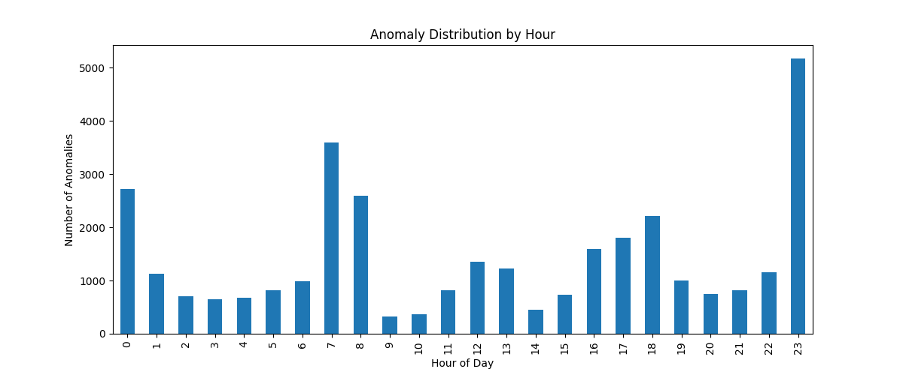
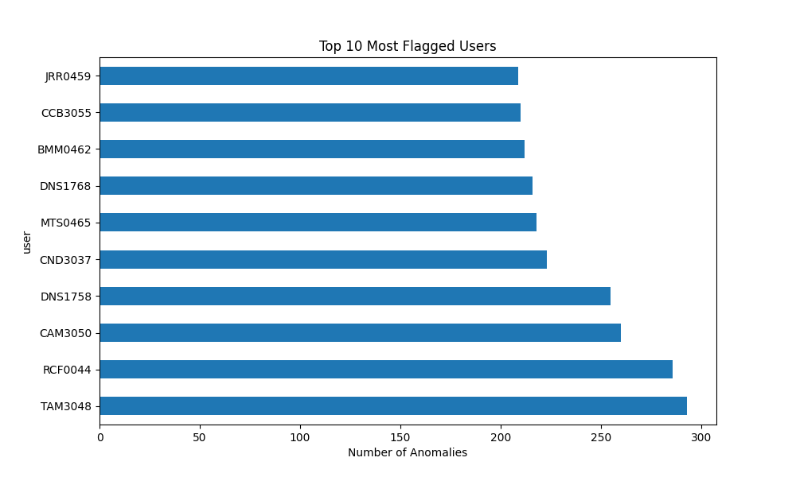

DOCUMENTATION 3 (Version 2)
Unsupervised Anomaly Detection Using Isolation Forest
Project Overview (V2)
BehaviorGuard-AI Version 2 advances the behavioral analytics pipeline established in Version 1 by introducing a machine learning–based anomaly detection mechanism. While the previous phase relied on statistical deviations and rule-based scoring, this version focuses on learning normal behavioral patterns directly from data using an unsupervised model.
In this phase, an Isolation Forest–based anomaly detection framework is implemented and evaluated on large-scale logon behavior data. The goal of Version 2 is to establish a robust baseline anomaly detection model that can identify abnormal user behavior without relying on labelled insider threat data, aligning with real-world UEBA deployment scenarios.
Problem Identification
Although statistical Z-score–based deviation analysis provides interpretable behavioral insights, it is limited in its ability to capture complex, non-linear relationships between multiple behavioral features. Insider threats often manifest as subtle or multivariate deviations that cannot be effectively detected using simple threshold-based or linear statistical methods.
Furthermore, labeled datasets containing verified insider threat instances are rarely available in practice, making supervised learning approaches impractical. This necessitates the use of unsupervised anomaly detection techniques capable of learning normal behavior distributions and isolating rare or abnormal patterns.
Motivation
Isolation Forest is widely adopted in security analytics due to its efficiency, scalability, and suitability for high-dimensional, unlabeled data. Its ability to directly model anomalies—rather than normal behavior density—makes it particularly effective for insider threat detection tasks.
The motivation behind Version 2 is to:
•	Introduce learning-based anomaly detection into the UEBA pipeline
•	Evaluate how machine learning models behave on engineered behavioral features
•	Establish a stable baseline model for future comparative studies
This phase emphasizes empirical evaluation, explainability through correlation analysis, and careful model selection.
Dataset Description
The dataset used in this phase consists of system logon activity derived from a CERT-based authentication log corpus. Each record captures user access behavior through attributes such as user identifier, timestamp, device identifier, and activity type (logon or logoff).
The dataset contains approximately 3.3 million records, making it representative of real-world enterprise authentication environments. Due to repository size constraints, raw datasets are maintained locally and excluded from version control, while all preprocessing scripts and derived features are fully tracked in the project repository.
Feature Engineering Pipeline (V1 → V2)
Version 2 builds directly upon the behavioral feature engineering pipeline developed in Version 1. Raw log events were aggregated into fixed time windows to generate structured behavioral features, including logon frequency, logoff frequency, unique device usage, hour of activity, and indicators for uncommon login times.
In addition to window-level features, user-specific statistical baselines were incorporated, such as average and standard deviation of logon activity and device usage. Standardized deviation metrics (Z-scores) were computed to quantify behavioral abnormalities relative to individual baselines.
These features collectively form a compact yet expressive representation of user behavior and serve as the input space for the anomaly detection model.
Isolation Forest Model Design
An Isolation Forest–based anomaly detection model was implemented to learn normal behavioral patterns from the engineered feature set. Prior to model training, features were scaled to ensure numerical consistency and to prevent dominance of high-magnitude variables.
The model outputs binary predictions, where normal behavior is classified as inliers and anomalous behavior is classified as outliers. Since the learning process is unsupervised, the model relies solely on feature distributions rather than labeled threat instances.
Hyperparameter Tuning and Model Selection
To identify a robust and well generalized baseline model, multiple Isolation Forest configurations were trained by systematically varying core hyperparameters, including the number of trees (n_estimators), the expected proportion of anomalies (contamination), and the subsampling size (max_samples). From a learning perspective, these parameters directly influence the ensemble’s capacity, the stability of isolation depth estimates, and the effective resolution of the anomaly decision boundary. Each configuration was evaluated using a combination of quantitative diagnostics and empirical validation techniques. Quantitative evaluation included analysis of the resulting anomaly rate to verify alignment with the assumed contamination level, as well as computation of the Pearson correlation between Isolation Forest anomaly outputs and the previously derived rule-based behavioral risk scores. Additionally, qualitative evaluation was performed through targeted inspection of extreme anomaly instances to assess consistency with known behavioral irregularities. From an ensemble learning standpoint, models with a higher number of estimators exhibited reduced variance in path length estimation and more stable partitioning of the feature space, leading to smoother and more reliable anomaly decision boundaries. Configurations employing controlled subsampling further mitigated over-isolation effects on dense regions of normal behavior. Based on these empirical observations, the selected configuration demonstrated superior correlation with behavioral risk indicators, improved decision boundary stability, and consistent anomaly rates across runs, and was therefore adopted as the Version 2 baseline anomaly detection model.
Model Persistence and Reproducibility
The finalized Isolation Forest model was serialized and stored using industry-standard model persistence techniques. Saving the trained model ensures reproducibility, enables future evaluation without retraining, and supports potential deployment or integration in later phases.
All tuning results, experimental observations, and intermediate artifacts were documented and version-controlled to maintain transparency and traceability.
Project Status (After Version 2)
At the conclusion of Version 2, the following milestones have been achieved:
•	Implementation of an unsupervised anomaly detection model
•	Successful integration of behavioral features into a learning-based framework
•	Empirical evaluation and tuning of model hyperparameters
•	Selection and persistence of a stable baseline model
•	Cleaned and well-maintained project repository
Version 2 marks the transition of BehaviorGuard-AI from statistical heuristics to machine learning–driven behavioral analytics.
## Key Findings & Visualizations

The evaluation of the Version 2 Isolation Forest model revealed several critical insights into user behavior:

### Anomaly Distribution by Hour
The distribution of flagged anomalies confirms that unusual login times (e.g., late-night activity between 23:00 and 00:00) remain a high-intensity indicator of behavioral risk.

### Top Flagged Users
A small subset of users exhibits a significantly higher anomaly rate (>10% of their total activity), warranting further investigation into whether they are legitimate power users or potential threats.

## Limitations
Despite its effectiveness, the current implementation has several limitations. The absence of labeled insider threat data restricts evaluation to proxy metrics and manual inspection. Additionally, the model operates on aggregated time windows and does not explicitly capture sequential dependencies between events.
These limitations motivate further exploration of sequence-aware and deep learning–based approaches.
## Future Direction
Subsequent versions of the project will extend the current framework by incorporating deep learning models such as autoencoders and recurrent neural networks to capture temporal dependencies in user behavior. Comparative analysis between classical anomaly detection techniques and deep learning approaches will be conducted to assess performance, stability, and interpretability.
These enhancements aim to move BehaviorGuard-AI closer to a comprehensive, research-oriented UEBA system suitable for real-world security analytics.
Conclusion
This documentation describes the design, implementation, and evaluation of an Isolation Forest–based anomaly detection model within the BehaviorGuard-AI framework. By leveraging unsupervised learning on engineered behavioral features, Version 2 establishes a robust baseline for identifying anomalous user behavior in the absence of labeled data. This phase significantly strengthens the system’s analytical capabilities and lays the groundwork for advanced behavioral modeling in future versions.

